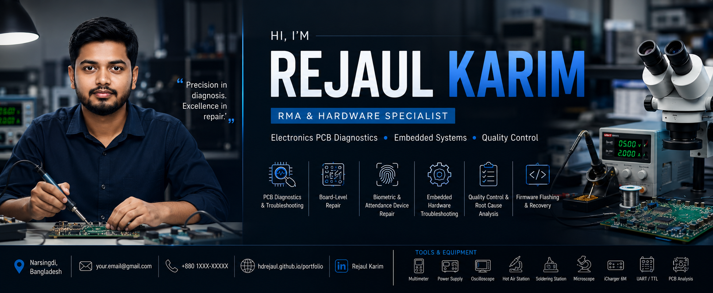

<p align="center">
  
</p>

<div align="center">

  <h1>🔬 Rejaul Karim</h1>
  <p><strong>Technical Executive | RMA & Electronics PCB Diagnostics Specialist | Micro-Soldering Expert</strong></p>

  <p>
    <a href="https://hdrejaul.github.io/portfolio/#" target="_blank">
      
    </a>
    <a href="https://hdrejaul.github.io/expense-tracker/" target="_blank">
      
    </a>
  </p>

  <p>
    <a href="https://hdrejaul.github.io/portfolio/RMA%20%26%20QC%20Specialist%20CV%20-%20Rejaul%20Karim.pdf" target="_blank">
      
    </a>
    <a href="mailto:rejaulakash@gmail.com" target="_blank">
      
    </a>
    <a href="https://wa.me/8801517824188" target="_blank">
      
    </a>
  </p>

  <p>
    
    
    
    
  </p>

</div>

---

## 🌐 Live Websites & Application Demos

Click below to visit the live sites in a new tab:

<p align="center">
  <a href="https://hdrejaul.github.io/portfolio/#" target="_blank">
    
  </a>
  &nbsp;&nbsp;
  <a href="https://hdrejaul.github.io/expense-tracker/" target="_blank">
    
  </a>
</p>

---

## 🎯 Professional Overview

Dedicated **Technical Executive & Hardware Specialist** with nearly 5 years of hands-on experience in high-density electronics production, micro-component level PCB diagnostics, component repair, and RMA (Return Merchandise Authorization) quality assurance.

Recognized for deploying structured fault-isolation protocols, micro-soldering precision, and establishing zero-defect hardware auditing workflows.

---

## 🛠️ Diagnostic Equipment Arsenal

| Category | Equipment / Tooling | Technical Application |
| :--- | :--- | :--- |
| **Measurement** | **Digital Multimeter** | Diode line value testing & power rail voltage auditing. |
| **Power** | **DC Bench Power Supply** | Precision voltage injection & short circuit detection. |
| **Current** | **DC Current Meter** | Real-time micro-amp fault tracking & current leaks. |
| **Rework** | **Hot Air Rework Station** | Thermal profiling for BGA IC reflow & removal. |
| **Soldering** | **Precision Soldering Station** | 0201/01005 SMD micro-soldering & jumpers. |
| **Optics** | **Digital Inspection Microscope** | Optical magnification for micro-crack detection. |
| **Protocol** | **iCharger 6M USB Analyzer** | QC 3.0 fast-charging & USB PD testing. |
| **Schematics** | **PCB Circuit Analysis** | Boardview CAD navigation & netlist trace tracking. |
| **Debug** | **UART / USB-to-TTL** | Boot cycle log tracing & serial debugging. |
| **Firmware** | **EEPROM & SPI Flash Tools** | SPI flash dumping & BIOS re-flashing tools. |
| **Safety** | **ESD Repair Workstation** | Anti-static matting & static-dissipative setup. |

---

## 🎓 Education & Credentials

| Year | Credential / Degree | Institution / Code |
| :---: | :--- | :--- |
| **2026** | **NSDA Certified Mobile Servicing Level-2** | National Skills Development Authority (`RPL-LE-MPS-L2`) |
| **2025** | **Mobile Servicing (Basic to Advanced)** | ST Institute of Mobile Technology |
| **2024** | **Bachelor of Social Science (BSS)** | National University (Sociology) |
| **2020** | **Basic Electrical & Electronics** | Jubo Unnayan (*Awarded Best Trainee*) |
| **2020** | **Computer Applications** | Technical Board (BTEB) |

---

## 📊 Core Expertise & Skill Set

```
Electronics PCB Diagnostics     [████████████████████] 98%
RMA & Quality Control Auditing  [███████████████████ ] 95%
SMD & Micro-Soldering (0201)   [███████████████████ ] 95%
Biometric & Attendance Repair   [██████████████████  ] 92%
Firmware Flashing & Recovery   [██████████████████  ] 90%
Office & Spreadsheets Audit     [█████████████████   ] 88%
```

---

## 💼 Featured Case Studies & Hardware Workflows

- **Multi-Layer Logic Board Short Circuit Isolation**: Thermal imaging & 1.0V DC injection for zeroing in on shorted SMD capacitors.
- **Smartphone Water Damage Trace Reconstruction**: 40x optical microscope inspection with 0.02mm micro-jumpering and UV mask curing.
- **Industrial RMA Batch Inspection & Yield Audit**: Structured batch audit of 500+ modules securing a 99.4% post-repair yield rate.
- **BGA PMIC IC Reballing & Thermal Reflow**: Lead-free pad oxidation removal, Sn63Pb37 BGA stencil reballing, and thermal reflow.

---

## 🚀 Featured Software & Web Projects

| Project Name | Description | Live Demo / Access |
| :--- | :--- | :---: |
| **💳 Expense Tracker App** | Modern web application designed for tracking personal expenses, managing budgets, and calculating real-time financial metrics. | [](https://hdrejaul.github.io/expense-tracker/) |

- **[Expense Tracker Application (Demo Click Here)](https://hdrejaul.github.io/expense-tracker/)**: Interactive budgeting & expense management web application.

---

## 📬 Connect with Me

<p align="left">
  <a href="https://hdrejaul.github.io/portfolio/#" target="_blank"></a>
  <a href="https://linkedin.com/in/rejaul-akash" target="_blank"></a>
  <a href="https://github.com/hdrejaul" target="_blank"></a>
  <a href="https://wa.me/8801517824188" target="_blank"></a>
  <a href="https://www.fb.com/rka2019" target="_blank"></a>
</p>

```
📍 Location: 291, New Elephant Road, Dhaka, Bangladesh
📧 Email: rejaulakash@gmail.com
📞 Phone: +880 1517-824188
```

---

<div align="center">
  <p><i>"Transforming Complex Hardware & PCB Failures into High-Yield Reliable Solutions."</i></p>
  <p>⭐ <b>Rejaul Karim</b> — Technical Executive & Electronics Diagnostician</p>
</div>
